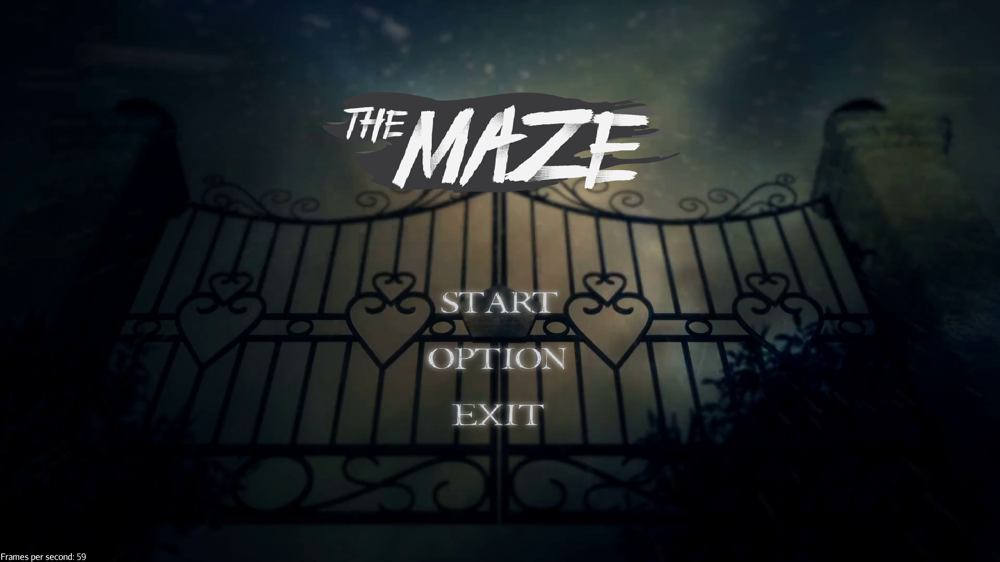
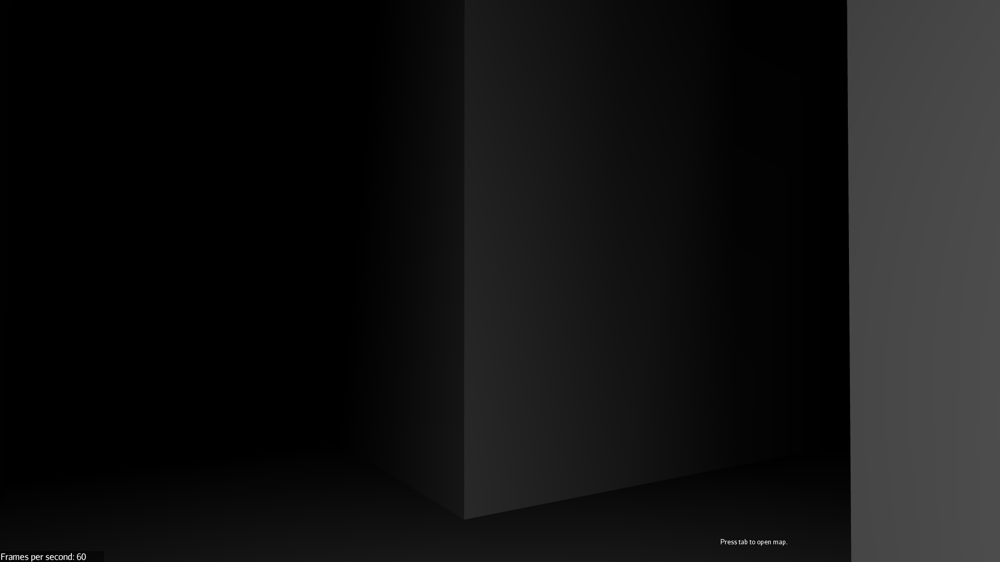
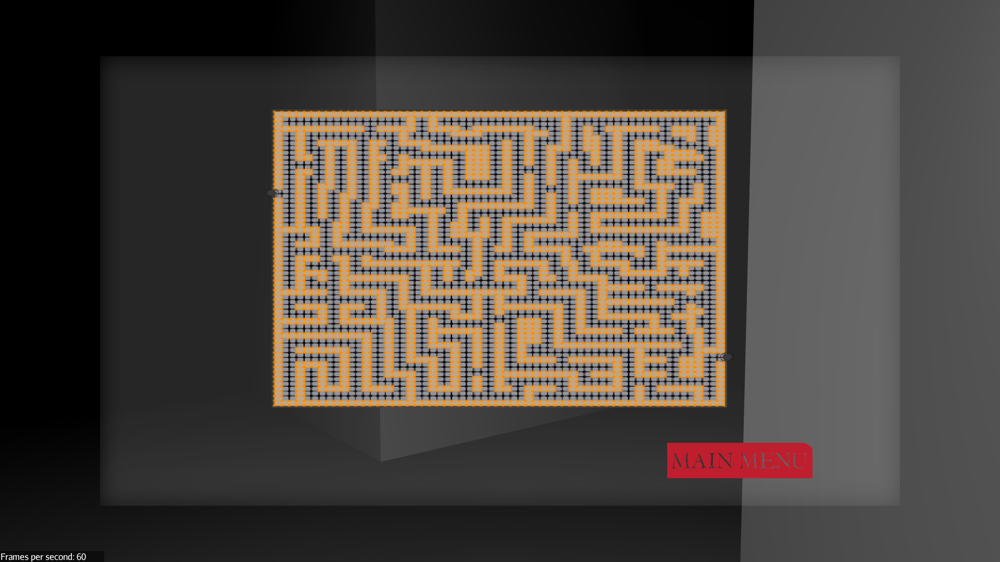
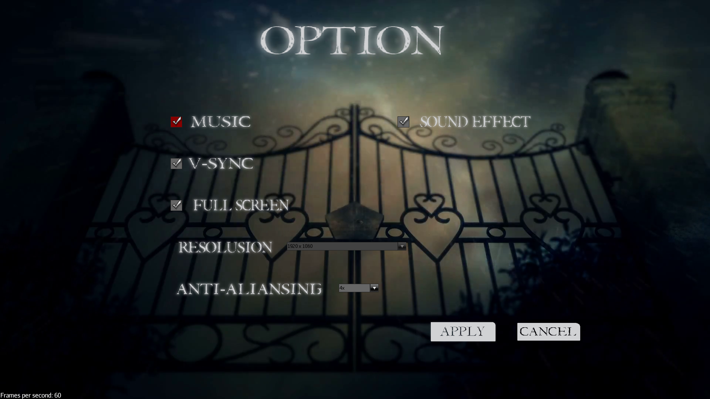

# The-Maze
Final Project

#### Download link

Click [Here](https://github.com/poom201211/The-Maze/releases/download/0.1v/The-Maze.rar) to download latest version

#### installation

Extract the zip file then run by clicking on the .jar file.
We're very sorry about the error in which some mac and linux users will not be able to run the program. (under maintainace)

#### Vision of the Program

“The Maze” is a 3-dimensional gaming program, written in Java. The main idea of the game is for the player to escape the maze, hence the name.  There will be more than just the maze; we will also add monsters, traps, and other bonuses to the game. 

#### Value Proposition

We think that this project is worth making because we will be using a program which is still in the borders of java, meaning we are going to be able to implement all the design patterns and knowledge we have learnt from you(Mr.James). Other than that, we will be learning new knowledge to do with 3D modeling and Jmonkey(Gaming engine based on java).

#### Participants

Each of us will be writing test class for each tasks we work on. If you do not feel comfortable with the task we assigned each other on, then you may make adjustments to them. Without further ado here are our tasks: 

**Thanapoom Rattanathumawat** - 6010546672:  Will be responsible for the traps, player control, terrain, bonus boost(Equipments for balancing the game and batteries), sound, and map generator.

**Poonnanun Poonnopathum** - 6010546699: Will be working on the monster AI, models, user interface (such as main menu, minimap, equipment bar, etc.) and animation.

#### Screen Shot

